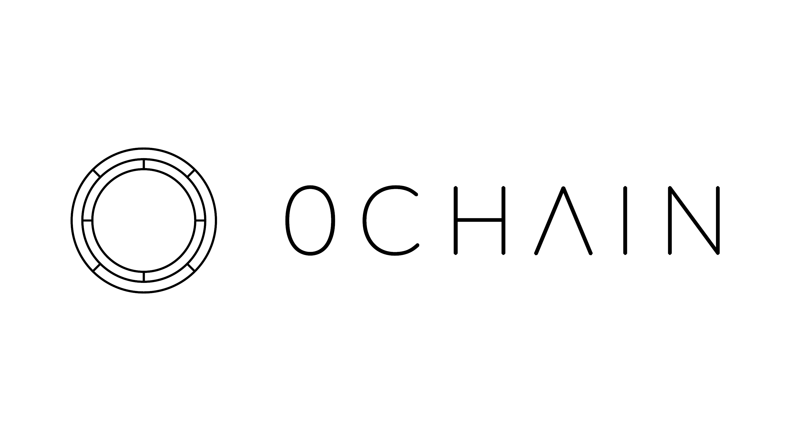

# 0chain

[0Chain](https://0chain.net/) is a decentralized blockchain-based storage platform with built-in privacy and security compliance. It provides high performance, enforceable SLAs, choice of providers for all enterprise grade applications.

[ZCN Token Economics](https://drive.google.com/file/d/1bxhjcx3SWUaUcgY8A2HBMcwc57Tg_Fjw/view)

# meta-zcn

The [**Yocto Project**](https://www.yoctoproject.org/) is an open source collaboration project that helps developers create custom Linux-based systems regardless of the hardware architecture. Meanwhile, [**OpenEmbedded**](http://www.openembedded.org/wiki/Main_Page) is a build automation framework and cross-compile environment used to create Linux distributions for embedded devices.

Together, these projects provides a flexible set of tools and a space where embedded developers worldwide can share technologies, software stacks, configurations, and best practices that can be used to create tailored Linux images for embedded and IoT devices, or anywhere a customized Linux OS is needed.

The **meta-zcn** OpenEmbedded Layer aims to provide recipes for 0chain related apps, tools and libraries in order to support the 0chain blockchain on a large variety of embedded devices.

# Documentation

- [`zcn` Distro Documentation](docs/distro.md)
- [`zcn-image-base` Image Documentation](docs/images.md)
- [How to cross-compile the `zcn` Embedded Linux OS](docs/build.md)
- [How to operate the `zcn` Embedded Linux OS](docs/run.md)
